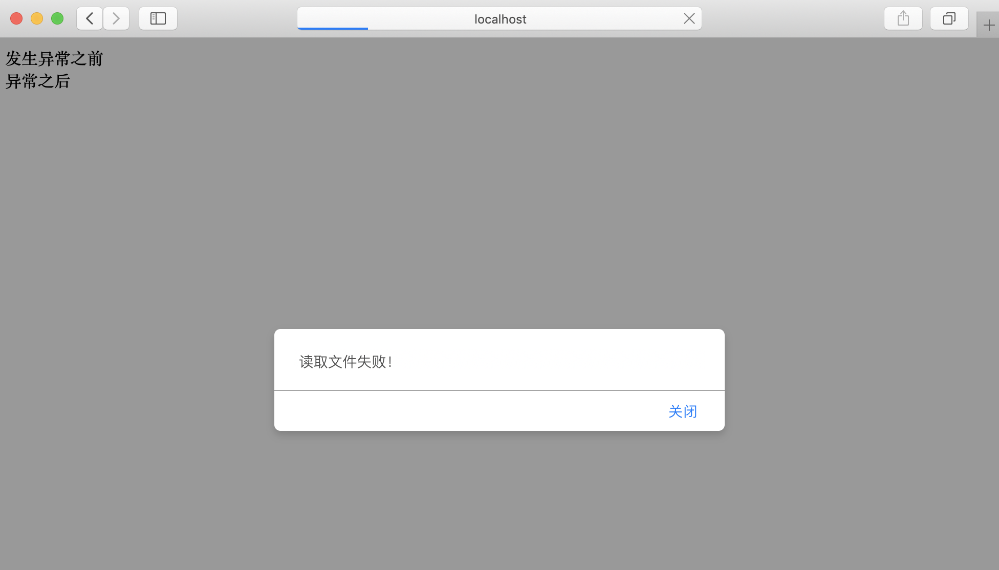

# Chapter13 异常处理
## 错误
错误在程序中随处可见，而错误本身也不是不好的东西。一个优秀的程序，应该能处理各种错误情况，将错误处理也纳入自己的程序范围内。

下面我们尝试去人为触发一个错误。

```php
//giveMeAnError.php
$file = fopen('notExist.txt','rw');
```

`fopen`函数会尝试打开一个文件，当这个文件不存在的时候则会报错。为了触发错误，我们并没有准备这样一个文件。这样，运行程序则会出现


这样的错误信息。

为什么有的时候我们需要针对错误信息做特别的处理呢？事实上，如果上面的代码是某个程序中间的一行，而这个程序运行在浏览器上，是一个网站中间的一部分。这时如果出现了这样的错误，会导致网页全部停止运行，并显示错误信息（如果你配置了显示错误信息的话）。


在运营网站的角度来讲，我们并不期望这样。如果这个文件找不到，我们可以让系统出现一个提示，绕过这个错误，让网站继续运行下去。如果对外显示了错误信息，还会将文件的路径暴露出来，这对服务器来说是不安全的。

如果是上面的文件读取，最简单的处理是这样做。

```php
//giveMeAnError.php
$filename = 'notExist.txt';
if(file_exists($filename)){
	$file = fopen('','rw');
}else{
	die('读取文件失败！');
}
```


如果希望网站的运行不会受到错误的影响，不妨尝试这个样子。

```php
echo '<script>alert("读取文件失败！")</script>';
```



这样会使用JavaScript的方式弹出一个提示，并且不影响程序其他部分的运行。

上面的几种方式都是最简单粗暴处理错误的方式。
## 异常
## 捕获-抛出异常
## 自定义异常